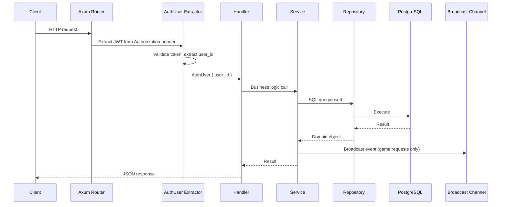
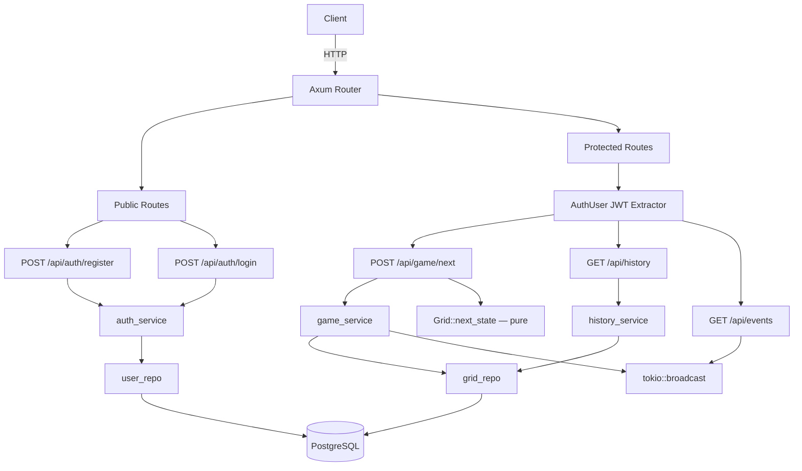

# System Overview

## What the project does

A REST API server that computes Conway's Game of Life next-state transitions.
Users authenticate, submit grids, receive the next generation, and can query
history or watch a real-time event stream.

## Tech stack

| Component | Technology |
|-----------|-----------|
| Language | Rust (edition 2021, rustc 1.94+) |
| Web framework | Axum 0.8 |
| Async runtime | Tokio (full features) |
| Database | PostgreSQL 16+ |
| DB driver | SQLx 0.8 (compile-time migration embedding) |
| Password hashing | Argon2id (via `argon2` crate 0.5) |
| Auth tokens | JWT (via `jsonwebtoken` crate 9) |
| Streaming | Server-Sent Events via `tokio::sync::broadcast` |
| Serialization | serde / serde_json |
| Config | `dotenvy` (.env file) |
| Observability | `tracing` + `tracing-subscriber` |
| HTTP middleware | `tower-http` (CORS, tracing) |

## High-level request flow



## Architecture diagram



## Layered architecture

```
handlers → services → repositories → database
                ↘ domain (pure game logic, no I/O)
```

Each layer has a single responsibility:
- **Handlers:** Parse HTTP, validate request shape, return responses
- **Services:** Orchestrate business logic, coordinate multiple repos
- **Repositories:** Own SQL queries, return domain objects
- **Domain:** Pure functions with zero I/O (game engine)
