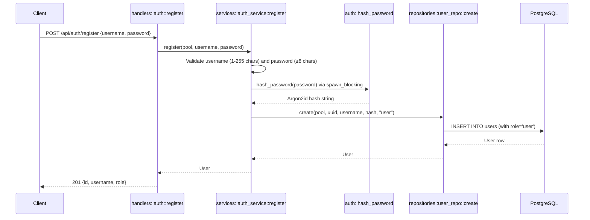
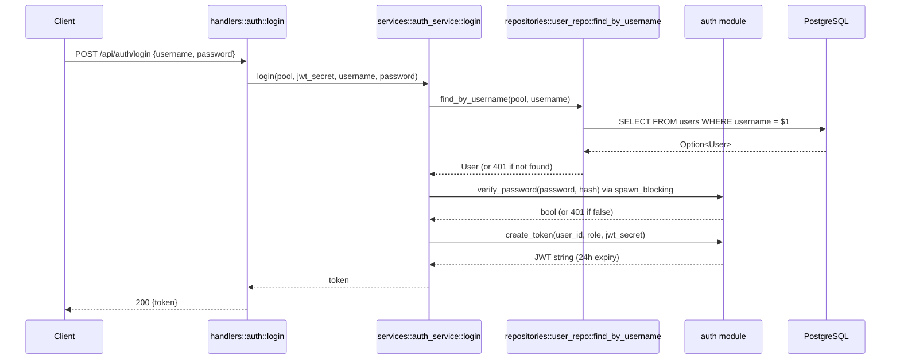

# Authentication Flow

## Overview

Authentication uses **Argon2id** password hashing and **JWT bearer tokens**.
There are no sessions, cookies, or API keys. All protected endpoints require
an `Authorization: Bearer <token>` header.

## Registration flow



## Login flow



## JWT token structure

- **Algorithm:** HS256 (HMAC-SHA256)
- **Claims:** `{ sub: Uuid, role: String, exp: usize }`
- **Expiry:** 24 hours from creation
- **Secret:** `JWT_SECRET` env var

Created in `src/auth/mod.rs::create_token()`, validated in `validate_token()`.

## Request authentication — AuthUser extractor

**File:** `src/auth/mod.rs`
**Type:** `pub struct AuthUser { pub user_id: Uuid, pub role: String }`

`AuthUser` implements Axum's `FromRequestParts<S>` trait. On every protected
request:

1. Reads `Authorization` header
2. Strips `Bearer ` prefix
3. Calls `validate_token(token, jwt_secret)` — decodes JWT, checks expiry
4. Extracts `user_id` from `claims.sub` and `role` from `claims.role`
5. Returns `AuthUser { user_id, role }` or `AppError::Auth` (401)

The JWT secret is obtained from `AppState` via Axum's `FromRef` trait.

The `is_admin()` helper method checks `self.role == "admin"`.

## Request authorization — AdminUser extractor

**File:** `src/auth/mod.rs`
**Type:** `pub struct AdminUser { pub user_id: Uuid }`

`AdminUser` delegates to `AuthUser`, then checks `is_admin()`. If the caller
is not an admin, returns `AppError::Forbidden` (403). Use this extractor on
handler functions that should be admin-only.

## Files involved in authentication

| File | Role |
|------|------|
| `src/auth/mod.rs` | `hash_password`, `verify_password`, `create_token`, `validate_token`, `AuthUser` + `AdminUser` extractors |
| `src/services/auth_service.rs` | `register()` and `login()` orchestration, input validation |
| `src/handlers/auth.rs` | HTTP handlers for `/api/auth/register` and `/api/auth/login` |
| `src/repositories/user_repo.rs` | `create()` and `find_by_username()` SQL queries |
| `src/models.rs` | `User` struct (id, username, password_hash, role, created_at), role constants |
| `src/error.rs` | `AppError::Auth` variant → 401, `AppError::Forbidden` → 403 |
| `src/lib.rs` | `AppState.jwt_secret` field |
| `src/config.rs` | `Config.jwt_secret` loaded from `JWT_SECRET` env var |

## How identity is attached to requests

The `AuthUser` struct is injected as an Axum extractor parameter in handler
function signatures:

```rust
pub async fn next_state(
    State(state): State<AppState>,
    auth: AuthUser,               // ← extracted from JWT
    Json(body): Json<NextStateRequest>,
) -> Result<Json<NextStateResponse>, AppError> { ... }
```

If the token is missing, malformed, or expired, the extractor returns
`AppError::Auth` which Axum converts to a 401 JSON response before the
handler body executes.

## Password hashing details

- **Algorithm:** Argon2id (default params from `argon2` crate 0.5)
- **Salt:** Random per-password via `SaltString::generate(&mut OsRng)`
- **Blocking:** Both `hash_password` and `verify_password` are offloaded to
  `tokio::task::spawn_blocking` to avoid stalling the async runtime
- **Storage format:** PHC string format (e.g. `$argon2id$v=19$m=19456,t=2,p=1$...`)
