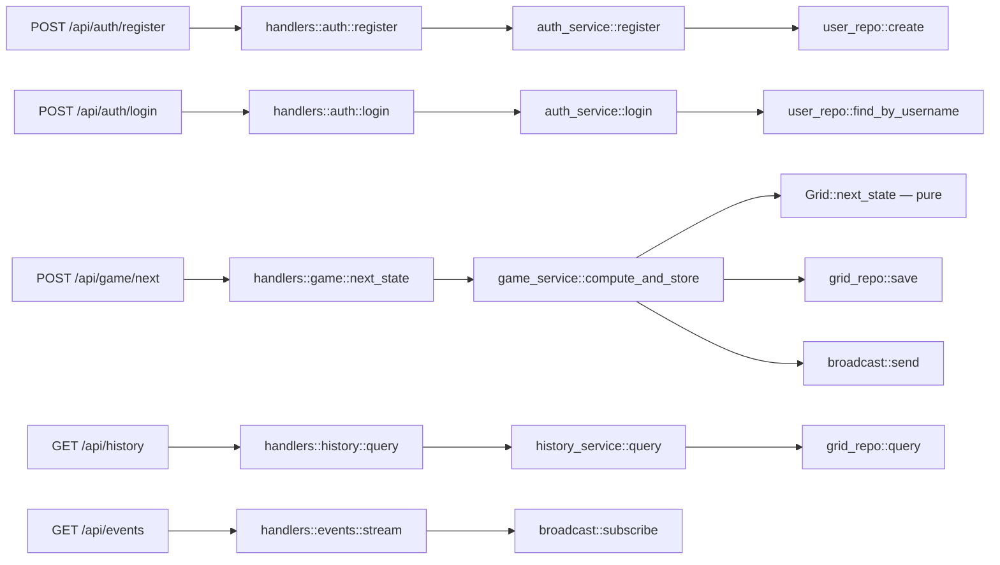

# Routes, Controllers & API

## Route definitions

All routes are assembled in `src/handlers/mod.rs` via `handlers::router()`.

```rust
Router::new()
    .route("/api/auth/register", post(auth::register))
    .route("/api/auth/login", post(auth::login))
    .route("/api/game/next", post(game::next_state))
    .route("/api/history", get(history::query))
    .route("/api/events", get(events::stream))
    .layer(DefaultBodyLimit::max(8 * 1024 * 1024))  // 8MB
```

## Endpoint reference

### Public routes (no auth required)

| Method | Path | Handler | Service | Purpose |
|--------|------|---------|---------|---------|
| POST | `/api/auth/register` | `handlers::auth::register` | `auth_service::register` | Create user account |
| POST | `/api/auth/login` | `handlers::auth::login` | `auth_service::login` | Authenticate, get JWT |

### Protected routes (JWT required)

| Method | Path | Handler | Service | Purpose |
|--------|------|---------|---------|---------|
| POST | `/api/game/next` | `handlers::game::next_state` | `game_service::compute_and_store` | Compute next generation |
| GET | `/api/history` | `handlers::history::query` | `history_service::query` | Query grid history |
| GET | `/api/events` | `handlers::events::stream` | — (direct broadcast subscribe) | SSE spectator stream |

### Admin routes

No dedicated admin-only routes exist. Admin privileges affect behavior
within shared routes — specifically `GET /api/history`, where admins can
query any user's history while regular users are scoped to their own.

## Request → handler → service → repo mapping



## Auth enforcement

Protected routes use the `AuthUser` extractor as a function parameter. If the
JWT is missing/invalid, Axum rejects the request before the handler executes.

The `AdminUser` extractor extends `AuthUser` by also checking
`claims.role == "admin"`. It returns 403 Forbidden for non-admin users.

```rust
// Protected — AuthUser required (any role)
pub async fn next_state(
    State(state): State<AppState>,
    auth: AuthUser,                    // ← 401 if missing/invalid
    Json(body): Json<NextStateRequest>,
) -> ...

// Protected with role-based scoping
pub async fn query(
    State(state): State<AppState>,
    auth: AuthUser,                    // ← role checked inside handler
    Query(params): Query<HistoryQuery>,
) -> ...
// Regular users: user_id param ignored, scoped to own history
// Admins: can use user_id param or see all history

// Public — no AuthUser parameter
pub async fn register(
    State(state): State<AppState>,
    Json(body): Json<RegisterRequest>,
) -> ...
```

## Request body limits

An 8MB `DefaultBodyLimit` is applied to all routes via the handler router.
This caps the maximum grid payload size.

## CORS

`CorsLayer::permissive()` is applied in `main.rs`, allowing all origins.
