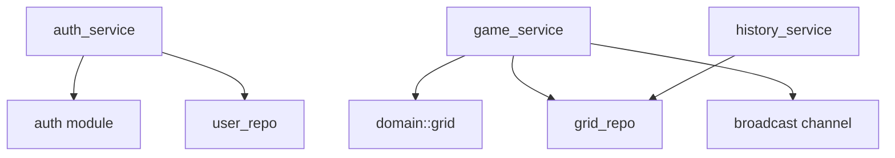

# Services & Business Logic

## Service layer overview

Services live in `src/services/` and orchestrate business logic between
handlers and repositories. They do not parse HTTP or build SQL — those
responsibilities belong to handlers and repositories respectively.

## auth_service (`src/services/auth_service.rs`)

### `register(pool, username, password) -> Result<User>`

1. Validates username length (1–255 chars)
2. Validates password length (≥8 chars)
3. Hashes password with Argon2id via `tokio::task::spawn_blocking`
4. Calls `user_repo::create()` to insert into `users` table
5. Returns the created `User`

**Side effects:** Database INSERT, CPU-heavy password hashing on blocking thread

### `login(pool, jwt_secret, username, password) -> Result<String>`

1. Looks up user by username via `user_repo::find_by_username()`
2. Returns 401 if user not found (generic "invalid credentials" message)
3. Verifies password via `tokio::task::spawn_blocking`
4. Returns 401 if password doesn't match
5. Creates JWT token with 24h expiry via `auth::create_token()`

**Side effects:** CPU-heavy password verification on blocking thread

**Dependencies:** `auth` module, `user_repo`

## game_service (`src/services/game_service.rs`)

### `compute_and_store(pool, event_tx, user_id, cells) -> Result<Grid>`

1. Constructs `Grid::new(cells)` — validates invariants
2. Computes `input.next_state()` — pure, deterministic
3. Serializes input and output grids to `serde_json::Value`
4. Persists to database via `grid_repo::save()`
5. Broadcasts `GameEvent` to SSE subscribers via `event_tx.send()`
6. Returns the output `Grid`

**Side effects:**
- Database INSERT into `grid_requests`
- Broadcast event to all connected SSE clients
- No external API calls

**Dependencies:** `domain::grid::Grid`, `grid_repo`, `broadcast::Sender`

## history_service (`src/services/history_service.rs`)

### `query(pool, filters) -> Result<Vec<GridRequestRow>>`

1. Converts page/per_page to offset
2. Delegates to `grid_repo::query()` with filter struct

**Side effects:** Database SELECT only (read-only)

**Dependencies:** `grid_repo`

## Pure domain logic — not a service

**File:** `src/domain/grid.rs`

The game engine (`Grid::new()`, `Grid::next_state()`) is pure domain logic
with zero I/O. It is called by `game_service` but has no dependencies on
any service, repository, or database.

## Dependency graph

