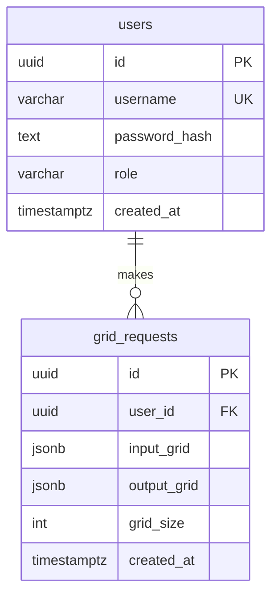

# Database, Models & Storage

## Database

- **Engine:** PostgreSQL 16+
- **Driver:** SQLx 0.8 (async, compile-time migration embedding)
- **Connection pool:** `sqlx::PgPool` (shared via `AppState`)
- **ORM:** None — raw SQL with `query_as::<_, T>()` and `FromRow` derive

## Tables

### `users`

| Column | Type | Constraints |
|--------|------|-------------|
| `id` | UUID | PRIMARY KEY |
| `username` | VARCHAR(255) | NOT NULL, UNIQUE |
| `password_hash` | TEXT | NOT NULL |
| `role` | VARCHAR(20) | NOT NULL, DEFAULT `'user'` |
| `created_at` | TIMESTAMPTZ | NOT NULL, DEFAULT NOW() |

**Indexes:** `idx_users_username` on `username`
**Migrations:** `migrations/001_create_users.sql`, `migrations/003_add_user_role.sql`

### `grid_requests`

| Column | Type | Constraints |
|--------|------|-------------|
| `id` | UUID | PRIMARY KEY |
| `user_id` | UUID | NOT NULL, FK → users(id) |
| `input_grid` | JSONB | NOT NULL |
| `output_grid` | JSONB | NOT NULL |
| `grid_size` | INT | NOT NULL |
| `created_at` | TIMESTAMPTZ | NOT NULL, DEFAULT NOW() |

**Indexes:**
- `idx_grid_requests_user_id` on `user_id`
- `idx_grid_requests_created_at` on `created_at`
- `idx_grid_requests_grid_size` on `grid_size`
- `idx_grid_requests_input_grid` on `input_grid` (hash — for exact-match filtering by input state)

**Migrations:** `migrations/002_create_grid_requests.sql`, `migrations/004_index_input_grid.sql`

## Entity relationship



## Rust model types (`src/models.rs`)

| Struct | Fields | Used by |
|--------|--------|---------|
| `User` | id, username, password_hash, role, created_at | `user_repo`, `auth_service` |
| `GridRequestRow` | id, user_id, input_grid, output_grid, grid_size, created_at | `grid_repo`, `history_service`, history handler |
| `GameEvent` | user_id, grid_size, input_grid, output_grid, created_at | `game_service`, SSE broadcast |

All DB models derive `sqlx::FromRow`. `GridRequestRow` also derives `Serialize`/`Deserialize` for JSON responses.

## Query patterns

### Static queries (`user_repo.rs`)

```rust
sqlx::query_as::<_, User>("INSERT INTO users ... RETURNING ...")
sqlx::query_as::<_, User>("SELECT ... FROM users WHERE username = $1")
```

### Dynamic queries (`grid_repo.rs`)

Uses `sqlx::QueryBuilder` to construct filtered queries at runtime:

```rust
let mut qb: QueryBuilder<Postgres> = QueryBuilder::new("SELECT ... WHERE 1=1");
if let Some(uid) = filters.user_id {
    qb.push(" AND user_id = ").push_bind(uid);
}
if let Some(input) = filters.input_state {
    qb.push(" AND input_grid = ").push_bind(input);
}
// ... additional optional filters
qb.push(" ORDER BY created_at DESC LIMIT ").push_bind(limit);
```

All values are parameterized — no SQL injection risk.

## Storage notes

- Grids are stored as JSONB (2D arrays of integers)
- No caching layer (no Redis, no in-memory cache)
- No message queue
- No file storage
- UUID v4 for all primary keys (generated in services, not DB)
