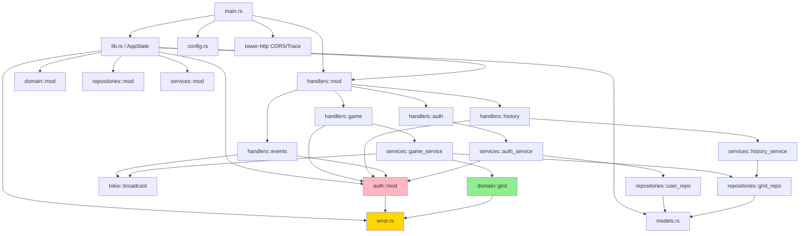

# Dependency Map

## Internal module dependency graph

**Legend:** 🟢 Pure domain logic | 🔴 Auth/security | 🟡 Error handling

## External crate dependencies

### Runtime

| Crate | Version | Purpose |
|-------|---------|---------|
| `axum` | 0.8 | HTTP framework, routing, extractors, SSE |
| `tokio` | 1 (full) | Async runtime |
| `sqlx` | 0.8 | PostgreSQL async driver, migrations |
| `argon2` | 0.5 | Argon2id password hashing |
| `jsonwebtoken` | 9 | JWT encode/decode |
| `serde` | 1 | Serialization/deserialization |
| `serde_json` | 1 | JSON parsing |
| `uuid` | 1 | UUID v4 generation |
| `chrono` | 0.4 | Timestamps |
| `dotenvy` | 0.15 | .env file loading |
| `tower-http` | 0.6 | CORS, tracing middleware |
| `tower` | 0.5 | Service trait, middleware |
| `tokio-stream` | 0.1 | BroadcastStream wrapper for SSE |
| `futures` | 0.3 | Stream trait |
| `tracing` | 0.1 | Structured logging |
| `tracing-subscriber` | 0.3 | Log output formatting |

### Dev only

| Crate | Version | Purpose |
|-------|---------|---------|
| `reqwest` | 0.12 | HTTP client for integration tests |

## External services

| Service | Connection | Purpose |
|---------|-----------|---------|
| PostgreSQL | `DATABASE_URL` env var | User storage, grid request history |

No other external services (no Redis, no message queue, no third-party APIs).
