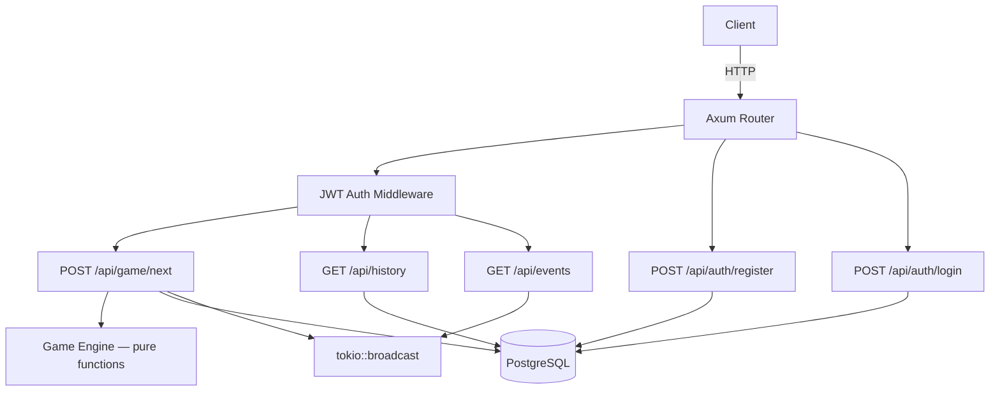

# Conway's Game of Life — Backend

A production-ready REST API server that computes Conway's Game of Life
next-state transitions, with user authentication, request persistence,
history queries, and real-time event streaming.

## Architecture

```
handlers → services → repositories → database
                ↘ domain (pure game logic)
```



**Key design decisions:**

- **Game engine is pure:** `Grid::new()` enforces invariants at construction
  (square, 3–1000 side length, values 0/1). `next_state()` is deterministic
  with zero I/O — trivially testable.
- **Layered architecture:** handlers parse HTTP, services orchestrate business
  logic, repositories own SQL queries. No layer skipping.
- **Argon2id** for password hashing (memory-hard, resistant to GPU attacks).
- **JWT bearer tokens** for stateless authentication (24h expiry).
- **SSE via `tokio::broadcast`** — lock-free fanout to all spectators.

## Quick Start

### Prerequisites

- Rust 1.75+ (`rustup` recommended)
- Docker (for PostgreSQL)

### Setup

```bash
# Start PostgreSQL
docker-compose up -d

# Copy env and adjust if needed
cp .env.example .env

# Run migrations and start the server
cargo run
```

The server starts on `http://localhost:3000`.

### Running Tests

```bash
# Unit tests (no database required)
cargo test --lib

# Full suite (requires PostgreSQL)
cargo test
```

### Debugging with `rust-lldb`

Build the debug binary and launch it under `rust-lldb`:

```bash
# Build in debug mode (default)
cargo build

# Start the debugger
rust-lldb target/debug/game_of_conway
```

Common LLDB commands:

```
# Set a breakpoint by function name
(lldb) b game_of_conway::domain::grid::next_state

# Set a breakpoint by file and line
(lldb) b src/domain/grid.rs:42

# Run the program
(lldb) r

# Step over / step into / step out
(lldb) n
(lldb) s
(lldb) finish

# Print a variable
(lldb) p grid
(lldb) frame variable

# Show backtrace
(lldb) bt

# Continue execution
(lldb) c

# List breakpoints / delete one
(lldb) br list
(lldb) br delete 1

# Quit
(lldb) q
```

To debug tests:

```bash
# Find the test binary
cargo test --no-run --lib 2>&1 | grep Executable

# Debug it (replace with the actual path from above)
rust-lldb target/debug/deps/game_of_conway-<hash>

# Inside lldb, run a specific test
(lldb) r --test-threads=1 test_name
```

## API Reference

### Authentication

#### `POST /api/auth/register`

Create a new user account.

```json
// Request
{ "username": "alice", "password": "securepassword" }

// Response 201
{ "id": "550e8400-...", "username": "alice" }
```

#### `POST /api/auth/login`

Authenticate and receive a JWT token.

```json
// Request
{ "username": "alice", "password": "securepassword" }

// Response 200
{ "token": "eyJhbGciOi..." }
```

### Game

#### `POST /api/game/next` 🔒

Submit a grid and receive the next generation. Requires `Authorization: Bearer <token>`.

Grid must be square, 3×3 to 1000×1000. Cell values: `0`/`1` or `false`/`true`.

```json
// Request — Blinker (vertical)
{ "cells": [[0,1,0],[0,1,0],[0,1,0]] }

// Response 200 — Blinker (horizontal)
{ "cells": [[0,0,0],[1,1,1],[0,0,0]] }
```

### History (Bonus I)

#### `GET /api/history` 🔒

Query stored grid requests with optional filters.

| Parameter  | Type      | Description            |
|------------|-----------|------------------------|
| `user_id`  | UUID      | Filter by user         |
| `grid_size`| integer   | Filter by grid size    |
| `from`     | ISO 8601  | Start of time range    |
| `to`       | ISO 8601  | End of time range      |
| `page`     | integer   | Page number (default 1)|
| `per_page` | integer   | Items per page (1–100) |

```json
// Response 200
{
  "data": [
    {
      "id": "...",
      "user_id": "...",
      "input_grid": [[0,1,0],...],
      "output_grid": [[0,0,0],...],
      "grid_size": 3,
      "created_at": "2026-06-10T12:00:00Z"
    }
  ],
  "page": 1,
  "per_page": 20
}
```

### Events (Bonus II)

#### `GET /api/events` 🔒

Server-Sent Events stream broadcasting all game generations in real time.

```
GET /api/events
Authorization: Bearer <token>

data: {"user_id":"...","grid_size":3,"input_grid":[[0,1,0],...],
       "output_grid":[[0,0,0],...],"created_at":"..."}
```

## Project Structure

```
src/
  main.rs                 # Entry point, server bootstrap
  lib.rs                  # Crate root, AppState
  config.rs               # Environment-based configuration
  error.rs                # AppError → HTTP status + JSON body
  models.rs               # User, GridRequestRow, GameEvent
  domain/
    grid.rs               # Grid type, validation, Conway's rules (+ unit tests)
  auth/
    mod.rs                # Argon2id hashing, JWT, AuthUser extractor
  repositories/
    user_repo.rs          # User CRUD queries
    grid_repo.rs          # Grid request storage + dynamic query builder
  services/
    auth_service.rs       # Register/login orchestration
    game_service.rs       # Compute → persist → broadcast
    history_service.rs    # Filtered history queries
  handlers/
    auth.rs               # POST register, login
    game.rs               # POST next state (accepts int and bool grids)
    history.rs            # GET history with pagination
    events.rs             # GET SSE stream with keep-alive
tests/
  register_login.rs       # Auth flow integration tests
  game_next.rs            # Game endpoint integration tests
  history.rs              # History query integration tests
  events.rs               # SSE + broadcast integration tests
```

## Conway's Game of Life Rules

1. **Birth:** A dead cell with exactly 3 live neighbors becomes alive.
2. **Survival:** A live cell with 2 or 3 live neighbors stays alive.
3. **Death:** All other cells die or stay dead.

Boundary: cells outside the grid are treated as dead (finite grid, no wrapping).
